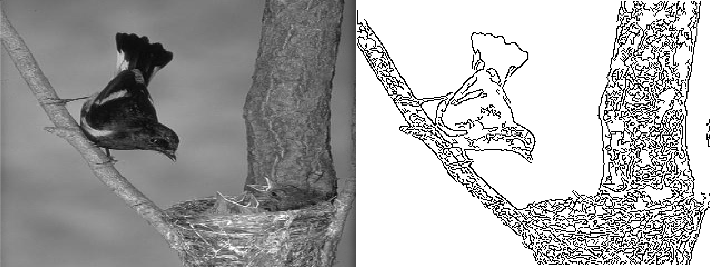

## Results from Canny Edge Detection Algorithm

For the images in PGM binary format, refer to files: results/edge_detected_image_\*.pgm and data/image_*.pgm.

## Citation

Please note that the code and technical details made available are for anyone interested to learn. The repo is not open for collaboration.

If you happen to use the code from this repo, please cite my user name along with link to my profile: https://github.com/balarcode. Thank you!
